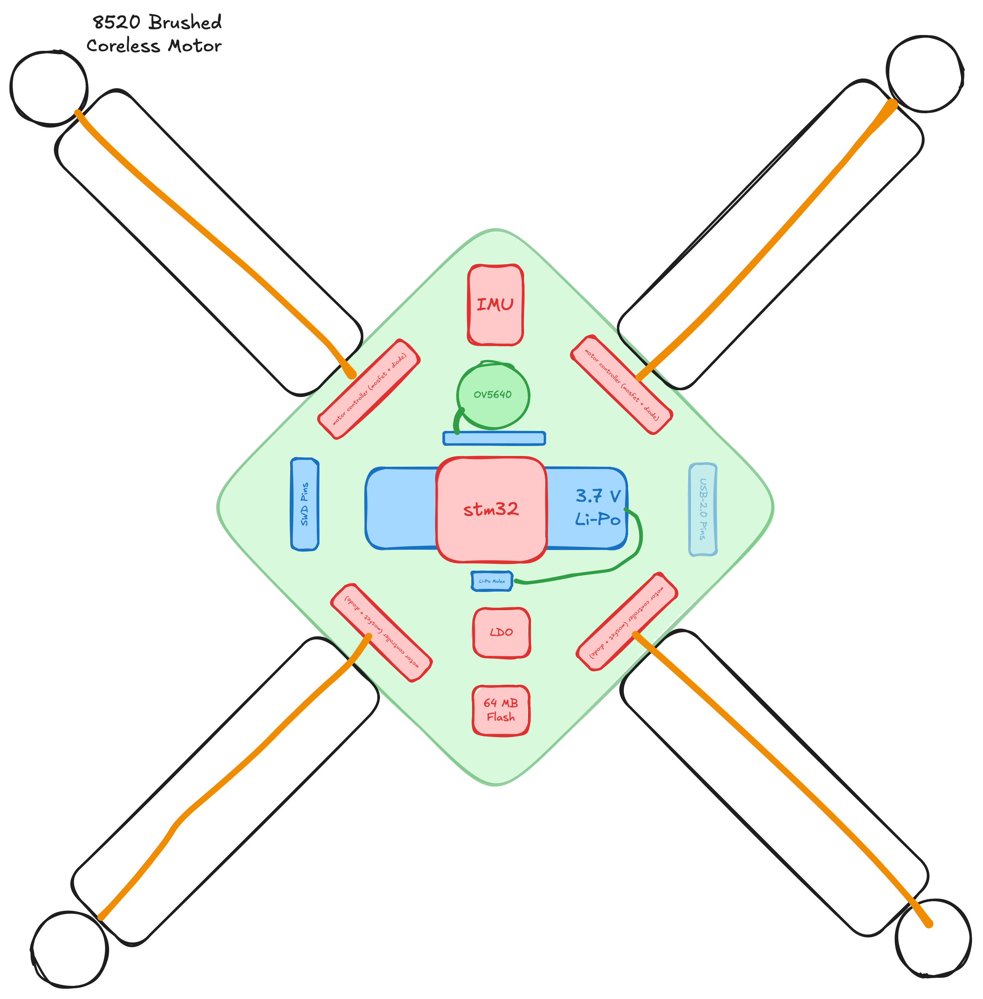

### Total hours:

- TheScientist101: 9
- grimsteel: 9

# May 23rd:

TheScientist101 + grimsteel

**Hours spent: 3 each (huddle)**

We decided the initial drone features.

We plan on making a laser tag drone:

- Each player will control their own drone. (We'll be manufacturing two for this.)
- The objective of the game will be for the drones to find and tag each other using the attached remote controllable laser and IR sensors.

Other features include semi-autonomous navigation as well as a camera for photos/FPV.

Our main concern is the thrust and the weight of the drone.

This is what we spent the majority of the time figuring out, but we learned a lot about aerodynamics.

We decided on an initial BOM, which is included in our [Full planning document](./PLANNING.md)

# June 4th:

TheScientist101 + grimsteel

**Hours spent: 3.5 each (huddle)**

We did extensive research into components and created a more thorough [BOM](./BOM.md)

- We decided to use an STM32H7 microcontroller because of it's increased processing capabilities compared to the ESP32 and its compatibility with camera protocols, specifically DCMI.
- We decided on a brushless motor and propellers to allow us a total weight of 80 grams.
- We picked a camera model and did some research into the supporting components.
- We did some initial calculations regarding the weight of the drone components using [ecalc](https://ecalc.ch).
- We did some research on batteries, but that honestly bamboozled us more, so the battery is very much TBD.

We also decided to deprioritize laser tag, instead focusing on a modular design.

We are approaching our budget pretty quickly... We must keep in mind the cost of iterations and small things such as solder stencil.

# June 10th

TheScientist101 + grimsteel

**Hours spent: 2.5 each (huddle)**

We finished up our component research. ([BOM](./BOM.md))

- After considering the components and precision needed (ESC) to properly control a brushless motor, we decided to use a brushed motor instead of a brushless motor to decrease the overall complexity of the project
- We did some research regarding motor control (MOSFETS) and chose the components for this
- We also picked the remaining miscellaneous components on the PCB (Flash, IMU)
- We're finally ready to start the PCB design!
- We made a rough sketch of the device, which is shown below:

