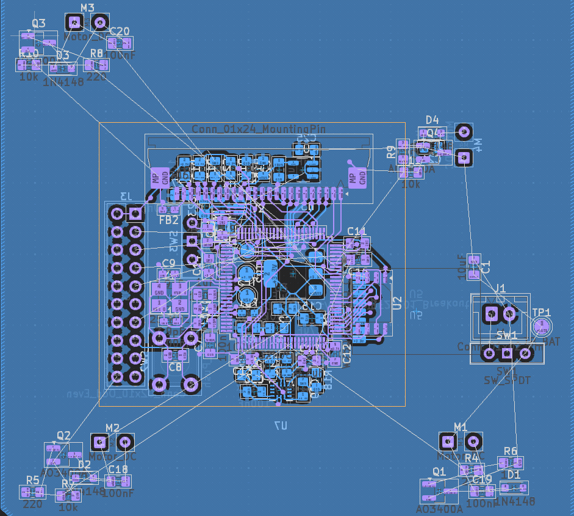
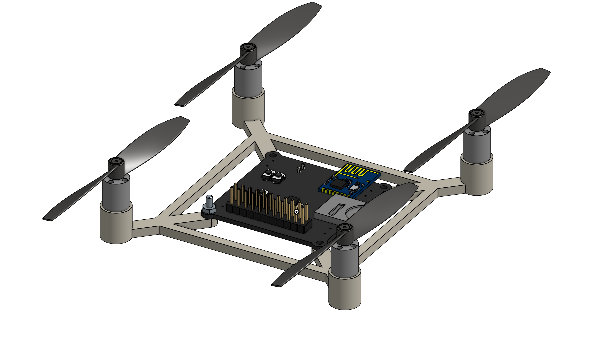

### Total hours:

- TheScientist101: 34.5
- grimsteel: 54

# May 23rd:

TheScientist101 + grimsteel

**Hours spent: 3 each (huddle)**

We decided the initial drone features.

We plan on making a laser tag drone:

- Each player will control their own drone. (We'll be manufacturing two for this.)
- The objective of the game will be for the drones to find and tag each other using the attached remote controllable laser and IR sensors.

Other features include semi-autonomous navigation as well as a camera for photos/FPV.

Our main concern is the thrust and the weight of the drone.

This is what we spent the majority of the time figuring out, but we learned a lot about aerodynamics.

We decided on an initial BOM, which is included in our [Full planning document](./PLANNING.md)

# June 4th:

TheScientist101 + grimsteel

**Hours spent: 3.5 each (huddle)**

We did extensive research into components and created a more thorough [BOM](./BOM.md)

- We decided to use an STM32H7 microcontroller because of it's increased processing capabilities compared to the ESP32 and its compatibility with camera protocols, specifically DCMI.
- We decided on a brushless motor and propellers to allow us a total weight of 80 grams.
- We picked a camera model and did some research into the supporting components.
- We did some initial calculations regarding the weight of the drone components using [ecalc](https://ecalc.ch).
- We did some research on batteries, but that honestly bamboozled us more, so the battery is very much TBD.

We also decided to deprioritize laser tag, instead focusing on a modular design.

We are approaching our budget pretty quickly... We must keep in mind the cost of iterations and small things such as solder stencil.

# June 10th

TheScientist101 + grimsteel

**Hours spent: 2.5 each (huddle)**

We finished up our component research. ([BOM](./BOM.md))

- After considering the components and precision needed (ESC) to properly control a brushless motor, we decided to use a brushed motor instead of a brushless motor to decrease the overall complexity of the project
- We did some research regarding motor control (MOSFETS) and chose the components for this
- We also picked the remaining miscellaneous components on the PCB (Flash, IMU)
- We're finally ready to start the PCB design!
- We made a rough sketch of the device, which is shown below:


# June 10th

TheScientist101 + grimsteel

**Hours spent: 2 each (huddle)**

We started the initial schematic design

- We created multiple subsheets to make collaboration easier (and to reduce merge conflicts)
- We did some initial wiring for the STM32, flash, and power supply


# June 11th

TheScientist101 + grimsteel

**Hours spent: 1 each (huddle)**

We continued the schematic design

- We added more power stuff for the STM32.
- We looked more into STM32 datasheet to figure out what was needed and what capacitor values to use.
- Throughout the day, we did some research into other drone projects to see how they did their schematics and what components they used. (not logged for time, but thought this was worth mentioning)


# June 12th

TheScientist101 + grimsteel
**Hours spent: 2 each (huddle)**

We continued the schematic design

- Siddhant worked on the motor control MOSFET things.
- He researched which MOSFETs were capable of handling the current and voltage we needed.
- He researched better voltage regulators.
- Urjith finished up the basic STM32 wiring.
- He researched which transceiver to use for the drone. We decided to use the NRF24L01+ transceiver because of its low cost and good range.
- He started wiring the transceiver to the STM32.

  

# June 13th-14th

grimsteel

**Hours spent: 5**

I added almost all of the peripherals to the schematic:

- **JTAG connector for debugging** - this one was relatively simple as it's just a bunch of connections
- **NRF Wireless Chip** - Urjith had started this already, so I just finished the wiring. I decided to use the SPI2 peripheral instead of SPI1 (more on this below)
- **OV5640 Camera** - This was definitely the most complex. The Adafruit breakout board for the OV5640 was a very helpful reference for figuring out the wiring and components/pullups needed. I had to use 2 additional LDOs as well. I connected this to the STM32's DCMI interface as well as the I2C1 peripheral.
- **IMU** - This was relatively simple. I used a Sparkfun breakout board as a reference, and connected it to the I2C2 peripheral. I'm not sure whether multiple I2C subs can exist on the same peripheral, but we have enough pins on the STM32 to just use another.


I also added a voltage divider to the battery so we can measure its voltage (using ADC1)


I decided to use an external 25 MHz crystal (recommended by the datasheet)


The hardest part of all of this was figuring out where to connect everything to the STM32. It's not like an ESP32 which has a GPIO matrix, which means there are specific pins for SPI and I2C and the other peripherals.

The STM32CubeMX software was a huge help with this. It helped me pick which pins to use to avoid conflicts.


With this configuration, SPI1 is actually unusable, which is why I used SPI2.

Here's the resulting schematic:


I did end up altering some of the power circuitry again (ferrite bead between VDDA/VREF and +3.3V)

# June 20th

TheScientist101 + grimsteel
**Hours spent: 2 each (huddle)**

Siddhant started routing the PCB. He finalized the placement of most of the components and started routing the power traces. To improve signal quality, we decided to use four layers instead of two, and we will need to move the components around and re-route the PCB.



Urjith added the micro secure digital card interface socket connector to the schematic. We researched the microSD specification and the necessity for pull-up resistors on the data lines.


We still need to add a HAT interface connector socket for extensibility and modularity, but we will do that later.

# June 21st-30th

grimsteel

**Hours spent: 5**

Both of us have been pretty busy this past week, but I've been gradually routing the new PCB.

We switched to 4 layers for better signal quality and easier routing, so we had to pretty much start from scratch.


Most of the routing is done, but we still need to do the last motor (figuring out where to place this will be hard) and a couple of the camera traces.

The last step will be to connect all of the battery nets. This is going to be pretty difficult as the tracks for the motors need to be really thick:


Routing them on the external layers would require only a 0.4mm wide track, but there's not really much space left there.

The `In2.Cu` layer is _supposed_ to be for power, and this is where I'll probably end up routing them. The issue is that it's an internal layer, and the copper weight will be 0.5 oz/ft^2 (we could make it 1 oz, but we need to minimize weigh)

2 layer PCBs can be under 100x100mm before JLCPCB starts getting super expensive, but the cutoff is 50x50mm for 4 layers. Thankfully, we're just under that right now.

# July 1st-2nd

**Hours spent:**

TheScientist101: 2.5 (huddle)

grimsteel: 2.5 (huddle) + 2

We decided to lock in and actually finish the PCB.

The JTAG connector was taking up too much space, so Urjith invented the MONKE connector to solve this. (It's basically a rearranged JTAG connector without the duplicate GND/3.3V pins).


He also added a DUCKDUCKGOOSE connector for extensibility and to allow the development of potential HATs for the drone. To save pins, it can be configured to either expose the SPI or the I2C pins with a DPDT switch.


We also rearranged some of the MCU pins to make routing easier. We realized that using a dedicated 24Mhz crystal for the camera would be better than trying to use one of the MCU output crystals.


Urjith replaced the boot switch with a solder jumper to save space.


He then placed all the new components on the PCB.

After the huddle, Siddhant finished up the routing of the PCB. This involved moving the SD card and the NRF around to make routing easier.

The power traces were all routed on the external layers with 2mm tracks to ensure they would be able to provide enough current to the motors.


# July 5th-9th

**Hours spent:**

grimsteel: 6

We realized that our current FPV system would be really slow - the nrf wouldn be able to cut it.

We decided to add FPV functionality on an extension board through our DDG connector.

I removed all the camera components and extended the DDG connector, both cleaning up a lot of the routing and minimizing the size of the PCB.

I added 5 extra GPIOs to the DDG connector and removed the I2C/SPI switch (and added dedicated pins)

To save space, I made the RST button SMD.

With the newly freed GPIO pins, I also added two extra buttons, some status LEDs, two neopixels, and a barometer.

I also added some silkscreen art. The PCB should hopefully be done!

### New Peripherals:


### Finished PCB (hopefully):

  

I also started work on the firmware. We're going to be using betaflight. The configuration is all done through a single config.h file.

# July 10th-14th

**Hours spent:**

TheScientist101: 2.5 (huddle) + 7 on controller

grimsteel: 2.5 (huddle) + 2 on controller + 3 on frame + 2 on firmware and pcb improvements

We designed the PCB for the controller. Apart from the devboard and NRF chip, it is a simple controller with two joysticks, 4 buttons, and three status leds. We initially wanted to use a Raspberry Pi Pico, but we decided to use an ESP32 C3 Supermini instead to save space on the PCB. Additionally, the ESP32 has built-in Wi-Fi which could allow us to pair a phone as an alternative controller.

While this should have been a simple PCB, we ran into trouble due to the devboard's lack of GPIOs. We initially thought to use a keyboard matrix: a technique we had learned from Hack Club's Hackpad program. While this would have allowed us to fit all of our components on the board, we were concerned about problems arising from integrating the joystick into the matrix. Since PCB iterations have become quite costly, we decided to use a simpler design that took advantage of a priority encoder. This allowed us to only use 3 GPIO pins for the 6 buttons (four actual buttons and two pressable joysticks). Finally, we also decided to use neopixels for our status LEDs, as they only require a single GPIO pin and can be controlled easily. However, we may decide switch to an SPI OLED since it can convey more information.

After Urjith designed most of the schematic, Siddhant did most of the PCB design.


Siddhant also designed a case/frame for the drone in Onshape. It looks immaculate if I do say so myself. I plan to add a perching mechanism and some mounting hooks for DDG extensions.



He also finished the betaflight configuration, changed the IMU to use SPI, added SD card detection (to see if an SD card is actually in the holder) and added a barometer to the drone.

# July 15th

**Hours spent:**

TheScientist101: 1

I tested some if the pinout for some joysticks I have should work for the controller, and they should. It took a while since the pins of the joysticks weren't long enough for the jumper wires, and I had to hold them in place while testing. I used this simple micropython script on a pico to test.

```python
from machine import ADC,Pin
import time

axis = ADC(Pin(28, Pin.IN))

while True:
    axis = axis.read_u16() / 65535.0
    print(f"value:{axis}")
    time.sleep(0.1)
```

# July 17th-19th

**Hours spent:**

grimsteel: 5

I wrote the firmware for the transmitter/controller. It uses `esp-idf`, and we're using the V202 protocol for transmission between the transmitter and the drone.

Right now, the firmware is pretty basic. It has an ADC sampling loop for the joysticks and sends the latest joystick values to the drone every 50ms.

I ended up adding an external ADC for the joysticks instead of relying on the built in ESP32 ADC as we do need a higher level of accuracy.


The ESP32 isn't very powerful, so in order to ensure that it's still responsive, I wrote this code to scale the raw ADC value into one between 0 and 255:

```cpp
/// Scale a signed 16-bit 3.3V ADC value to an unsigned byte
uint8_t scale_adc_value(int16_t value) {
  uint32_t unsigned_value = value < 0 ? 0 : value;
  // max input voltage: 3.3V
  // max range: 4.096V
  // max output value (theoretical): 2^15
  // max actual output value: 3.3V/4.096V * 2^15 = 26400
  // 26400 * 5 >> 9 = 257 (which is really close to 255)
  // 26214 * 5 >> 9 = 255 (max value that yields 255)
  uint8_t result = 255;
  if (unsigned_value <= 26214) {
    result = (unsigned_value * 5) >> 9;
  }
  return result;
}
```

# July 20th

**Hours spent:**

TheScientist101: 5.5

grimsteel: 3

I spent some time polishing up the overall project. I added a battery holder to the frame, and exported the production files for the CAD and PCB to the repo.


I ended up switching out our battery for a lighter one, even though it has a lower capacity. Even though this will result in a reduced flight time, it should still be in the 3-4 minute range.

I'm actually not 100% sure what battery connector this uses, so I asked in #electronics to see if anyone recognizes it. If all else fails, we can solder our own connector on fairly easily.

I also added an FPV connector to the PCB, as this will be cheaper than making a DDG extension board. We should be able to directly plug in the FPV module we're buying into the PCB through this.


Routing this was pretty hard, as space is scarce in the PCB, but I was able to do it pretty easily on In1.Cu after I moved the IMU to get some more space.

It's me Urjith from here on out in today's journal entry (before it was Siddhant).

I designed the case for the controller. I thought it would be cool to sandwich the PCB between two parts of a case since it would look pretty bare-bones. I designed the case in OpenSCAD, and it took a while to get the dimensions right, but I think it looks pretty good.

While designing the case for the controller, I double-checked the joystick footprint and realized that the footprint I had was wrong. I had to change the footprint in the PCB, which was a bit of a pain, but luckily I didn't have to reroute too much. Subsequently I had to adjust the case to fit the new footprint, but that was pretty easy.

I also had to add M2 holes to the PCB for the case screws. I am realizing as I am typing this that both of the holes are near the front, which might be problematic. I should probably add some more holes to the back of the PCB.

Designing the case took a while because converting the coordinates from the PCB to OpenSCAD was a little tedious. Luckily, I got most of the coordinates right on my first try, so I didn't have to redo the case too much (except for the joysticks).

Gosh that took longer than I expected. I used to like OpenSCAD, but now I am not so sure.


