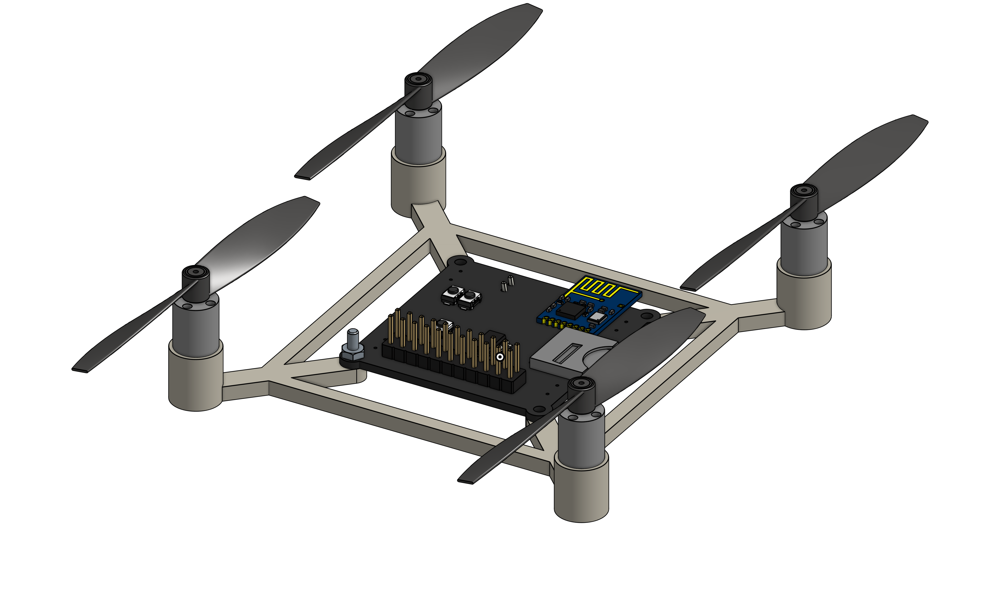
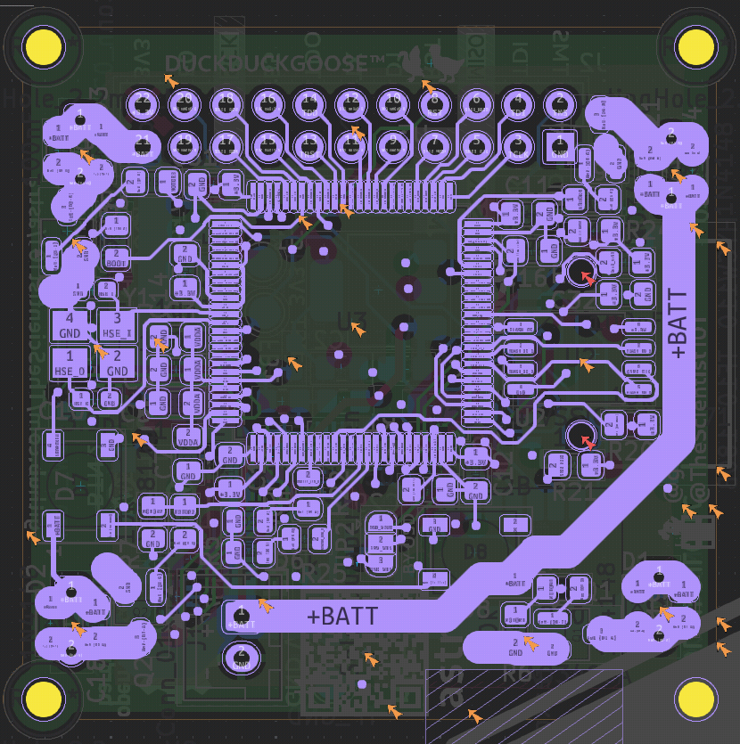
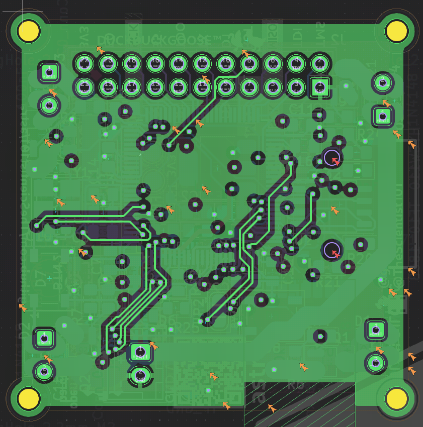
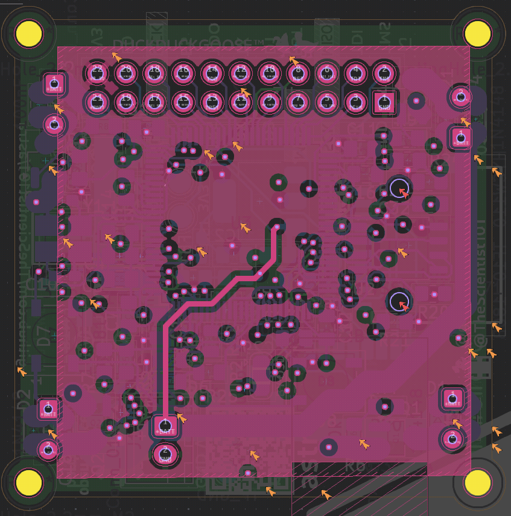
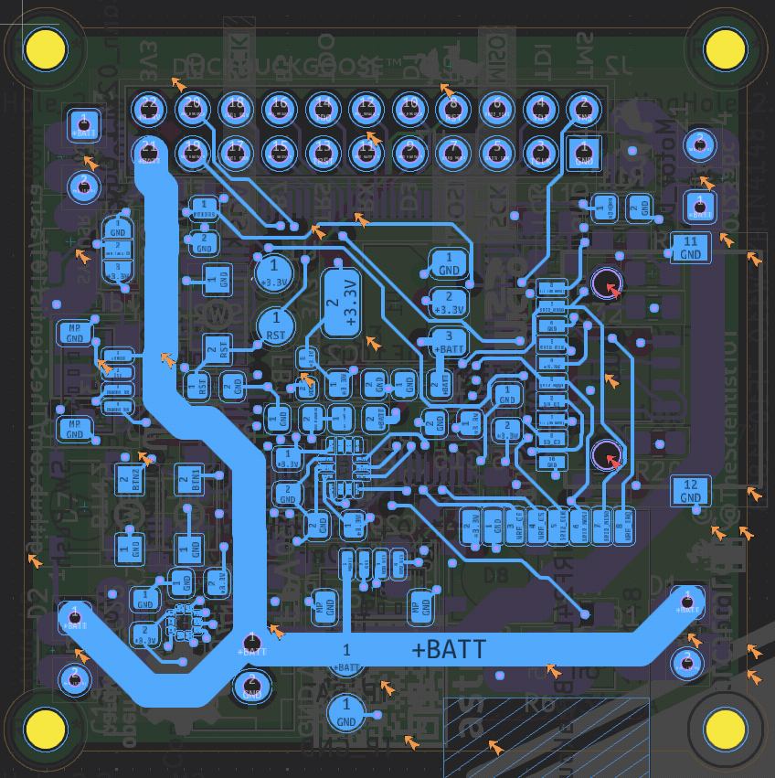
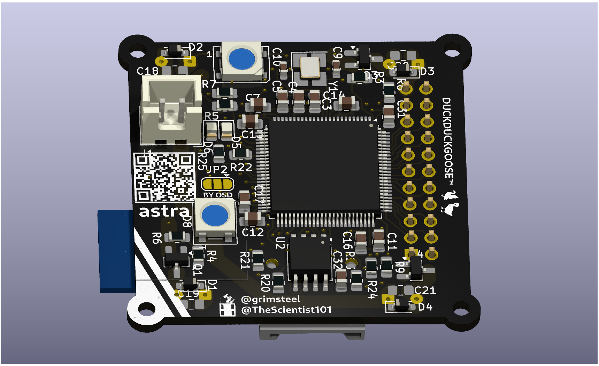
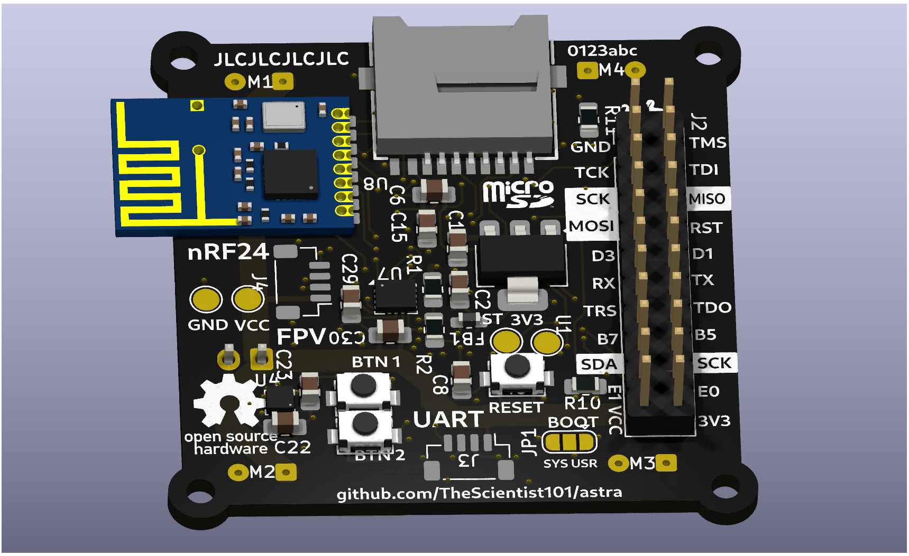

<h1 align="center">astra</h1>

   

<h3 align="center">An open source, low cost, extensible brushed drone.</h3>

## What is Astra?

Astra is an `~80mm` brushed quadcopter. It it powered off of a single 1s Li-Po (`4.2V`), and uses four brushed motors.

Astra supports an optional FPV module, and includes a HAT-style pin interface on the flight controller.

We've also designed our own transmitter for Astra. The flight controller and transmitter use an `nRF24` to communicate with low latency.

Every part of Astra was designed from scratch - the flight controller, the transmitter, and the frame.

## Cost

All of the components for the drone and can be bought for around `$75`. (See the [`BOM`](./BOM.md) for more details!)

The bulk of this is actually the cost to buy the PCBs and stencil (which is anticipated to be around `$25`). The actual component cost is closer to `$50`.

> Note:
> Adding an FPV system to the drone is relatively costly. The FPV Camera + VTX module costs `$25`, which is actually on the cheaper end for these systems. The total cost with the FPV module is slightly less than `$100` before taxes and other fees.

## Technical Details

The Flight Controller uses an `STM32H750`. This is a powerful chip with plenty of GPIO pins for peripherals. We plan to implement a software OSD within the H7 for the FPV interface.

PCB files can be found within the `drone/pcb/` folder.

The Flight Controller uses the [betaflight](https://betaflight.com/) firmware. A betaflight config file as well as flashing instructions can be found in the `drone/firmware/` folder

The frame for the FC was designed in Onshape. CAD files can be found in `drone/frame/`;

**Peripherals**:
- `BMI270` - IMU
- `BMP388` - Barometer
- 2 `WS2812B`s
- 2 configurable buttons
- microSD Card Socket
- A 22 pin header for HAT-style extensions. Includes SWD, UART, SPI, I2C, and extra GPIOs.
- An extra UART connector.

The Ground Transmitter uses an `ESP32-C3-SuperMini` (a C3 chip similar to the XIAO that we already have on hand). It features:
- 3 `WS2812B`s
- 2 Joysticks, configured for mode 2 control
- 4 configurable buttons (+2 from the joysticks)

The PCB, firmware, and case for the transmitter can be found in the `controller/` folder

## Pictures

**Copper Layers:**

   

**PCB 3D Render:**

 
